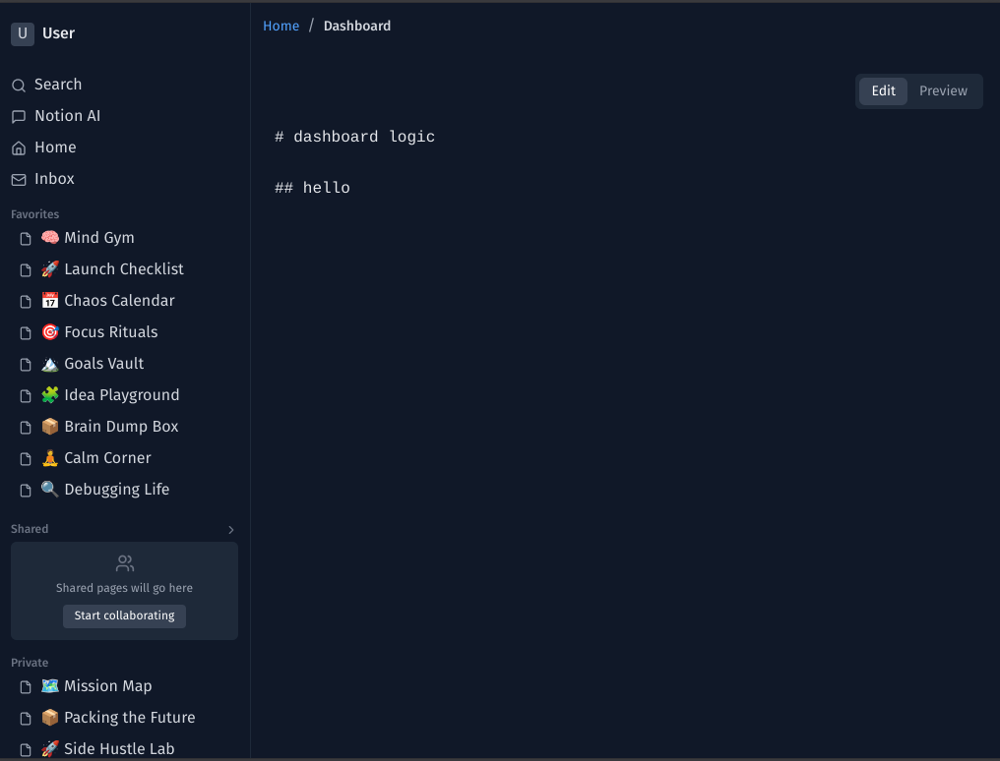
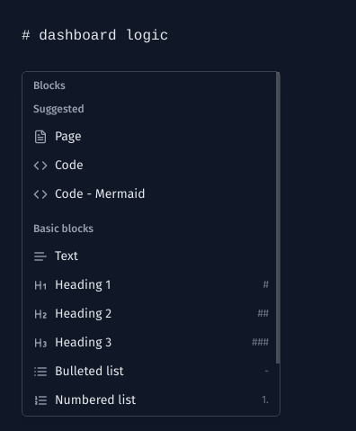
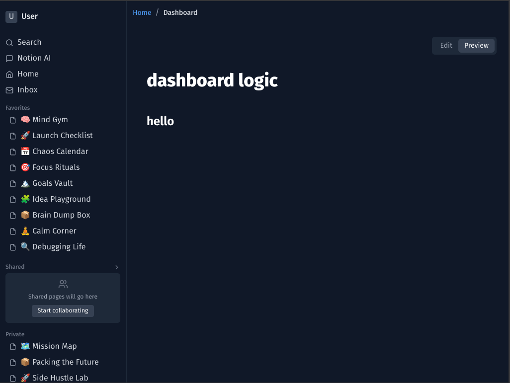

# 🧠 Notion Clone – AI-Enhanced Markdown Workspace

A sleek, block-based Notion-style editor built with **Next.js**, **Tailwind CSS**, and **React**, featuring live Markdown rendering, slash commands, sidebar navigation, and future-ready extensibility.

---

## ✨ Features

- 📝 **Block-Based Editing** – Write and manage content in modular blocks, just like Notion.
- 🧠 **AI Command Hook** – Hooks in place to trigger future AI features via `/` or `space`.
- ⚡ **Live Markdown Preview** – Write with Markdown and see it rendered in real-time using `react-markdown`.
- 🎯 **Slash Commands** – Type `/` or click the ➕ to bring up contextual block options.
- 🧱 **Custom Sidebar Navigation** – Sidebar with section grouping, emoji labels, and mobile support.
- 🌓 **Dark Mode Design** – Fully themed UI with clean minimalist focus and developer-centric aesthetic.
- 📱 **Responsive Layout** – Optimized for desktop and mobile with animated sidebar overlay behavior.

---

## 🚀 Tech Stack

| Layer          | Stack / Library                          |
|----------------|------------------------------------------|
| Frontend       | React (Next.js App Router)               |
| Styling        | Tailwind CSS, Radix UI, custom themes    |
| Markdown       | `react-markdown`, `remark-gfm`, `rehype-highlight` |
| Icons          | `lucide-react`                           |
| Fonts          | `Inter`      |
| Routing        | App Router + Layout.tsx pattern          |
| State          | React hooks (`useState`, `useRef`)       |

---


## 🧪 Noteworthy Design Decisions

- **Block Model → Markdown Hybrid**: Early prototype using textarea + block parsing, paving the way for future structured block trees.
- **Minimalist UI, Maximum Intent**: Every component is built to be modular, accessible, and scalable.
- **Mobile Sidebar with Overlay**: Uses `fixed + translate-x` for clean slide-in effect.

---

## 📸 Screenshots

| Full Layout        | Slash Menu        | Markdown Preview |
|--------------------|-------------------|------------------|
|  |  |  |

---

## 🧑‍💻 Author

**Daniel Philip Johnson**  
Frontend Engineer & Design System Architect  
🌍 [danielphilipjohnson.com](https://danielphilipjohnson.com)

---

## 📚 Future Roadmap

- [ ] Drag & drop block ordering
- [ ] AI content generation (`space` trigger)
- [ ] Database-backed page storage (e.g. Supabase or Prisma)
- [ ] Theme switcher (light/dark/system)
- [ ] Plugin-style command menu using `cmdk`
- [ ] Block editor system


---

## 🪄 Try it locally

```bash
git clone https://github.com/danielphilipjohnson/notion-markdown-previewer
cd notion-markdown-previewer
npm install
npm dev
